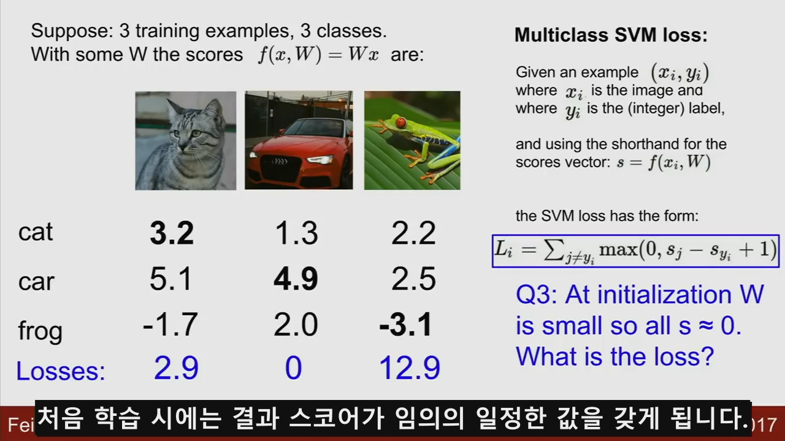

# CS231N Spring 2017 Korean Subtitles
Translation project of [CS231N 2017 lecture video](https://www.youtube.com/playlist?list=PLC1qU-LWwrF64f4QKQT-Vg5Wr4qEE1Zxk)  
Also see [CS231N Website](http://cs231n.stanford.edu/)

----------
## Instructors:
    Fei-Fei Li: http://vision.stanford.edu/feifeili/  
    Justin Johnson: http://cs.stanford.edu/people/jcjohns/  
    Serena Yeung: http://ai.stanford.edu/~syyeung/  

----------
## Prerequisites
    Video Player with codecs which might be let you watch..
        Recommendation
            Windows : PotPlayer(kakao)
            Linux   : SM Player
            IOS     : "Whatever you can"

----------
## Usage

1. Download lecture videos from youtube
    - Use Downloader like [4k video downloader](https://www.4kdownload.com/ko/products/product-videodownloader) (Maybe support Windows, linux, MacOS)
    - Download this [link](https://www.youtube.com/playlist?list=PLC1qU-LWwrF64f4QKQT-Vg5Wr4qEE1Zxk)
    - If you use "4k video downloader", you can download whole lectures "at once" not "each" (use Playlist !!!).
      
    

2. and Apply subtitles  

        root
        └── eng
            └── Subtitles in English.
        └── kor 
            └── Subtitles in Korean.
        └── lagacy
            └── You dont need this.

----------
## Table of Contents (CS231N 2017)

 Please see also
1. Detailed syllabus 
 [[2017]](http://cs231n.stanford.edu/2017/syllabus.html) 
 [[2018]](http://cs231n.stanford.edu/syllabus.html)
2. Lecture Vodeos Playlist
[[2017]](https://www.youtube.com/playlist?list=PLC1qU-LWwrF64f4QKQT-Vg5Wr4qEE1Zxk) 
[[2018]](https://www.youtube.com/playlist?list=PLkt2uSq6rBVctENoVBg1TpCC7OQi31AlC)

| Lecture  | Description       |Video(youtube)      |slides      | Subtitles|
|:--------:|:-----------------:|:-----------:|:--------:|:--------:|
| 1        |Introduction to Convolutional Neural Networks for Visual Recognition|[video]|[2018]
[2017]|[eng]
[kor]
| 2        |Image Classification|[video]|[2018]
[2017]|[eng]
[kor]
| 3        |Loss Functions and Optimization|[video]|[2018]
[2017]|[eng]
[kor]
| 4        |Introduction to Neural Networks|[video]|[2018]
[2017]|[eng]
[kor]
| 5        |Convolutional Neural Networks|[video]|[2018]
[2017]|[eng]
[kor]
| 6        |Training Neural Networks I|[video]|[2018]
[2017]|[eng]
[kor]
| 7        |Training Neural Networks II|[video]|[2018]
[2017]|[eng]
[kor]
| 8        |Deep Learning Software|[video]|[2018]
[2017]|[eng]
[kor]
| 9        |CNN Architectures|[video]|[2018]
[2017]|[eng]
[kor]
| 10       |Recurrent Neural Networks|[video]|[2018]
[2017]|[eng]
[kor]
| 11       |Detection and Segmentation|[video]|[2018]
[2017]|[eng]
[kor]
| 12       | Visualizing and Understanding|[video]|[2018]
[2017]|[eng]
[kor]
| 13       |Generative Models|[video]|[2018]
[2017]|[eng]
[kor]
| 14       |Deep Reinforcement Learning|[video]|[2018]
[2017]|[eng]
[kor]
| 15       |Efficient Methods and Hardware for Deep Learning|[video]|[2018]
[2017]|[eng]
[kor]
| 16       |Adversarial Examples and Adversarial Training|[video]|[2018]
[2017]|[eng]
[kor]

----------
## Screenshot

----------
## Contributors

----------
